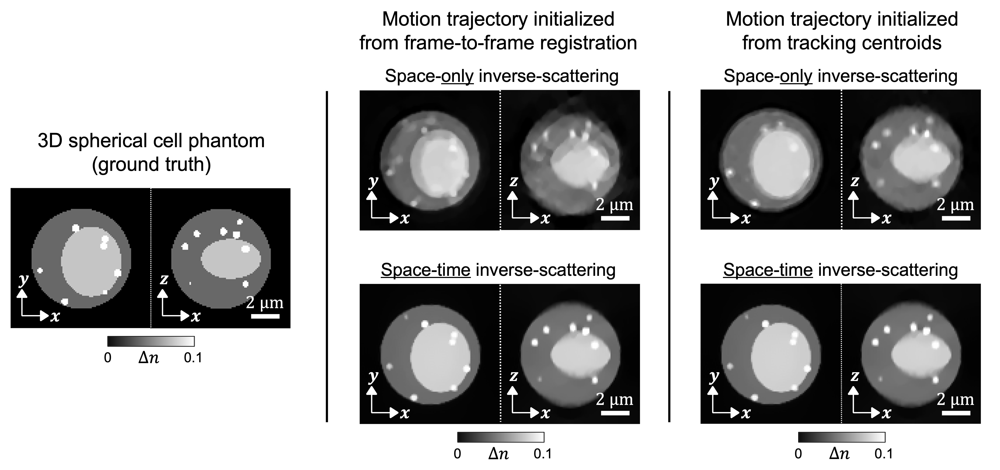

# Space-time inverse-scattering of translation-based motion

This repository contains the MATLAB simulation and reconstruction code for space-time inverse scattering with translation-based motion, as used in the following publication:

**Kim, Jeongsoo, and Shwetadwip Chowdhury. "Space-time inverse-scattering of translation-based motion." arXiv preprint arXiv:2412.09403 (2024).**

**Abstract**:
In optical diffraction tomography (ODT), a sample's 3D refractive-index (RI) is often reconstructed after illuminating it from multiple angles, with the assumption that the sample remains static throughout data collection. When the sample undergoes dynamic motion during this data-collection process, significant artifacts and distortions compromise the fidelity of the reconstructed images. In this study, we develop a space-time inverse-scattering technique for ODT that compensates for the translational motion of multiple-scattering samples during data collection. Our approach involves formulating a joint optimization problem to simultaneously estimate a scattering sample's translational position at each measurement and its motion-corrected 3D RI distribution. Experimental results demonstrate the technique's effectiveness, yielding reconstructions with reduced artifacts, enhanced spatial resolution, and improved quantitative accuracy for samples undergoing continuous translational motion during imaging.

# Experimental dataset

The experimental dataset for running the code can be downloaded from the link below. This dataset contains angular scattering measurements of a microsphere and scattering phantom undergoing translational motion between frames. It also includes the parameters of the angle-scanning imaging system.

**Download Link:** https://dataverse.tdl.org/dataset.xhtml?persistentId=doi:10.18738/T8/KYYDHX

# Numeriacl Simultaion

